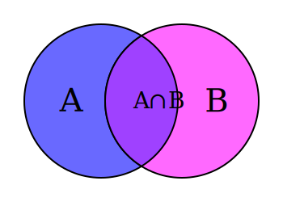
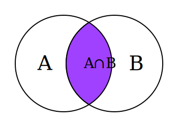
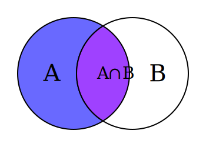
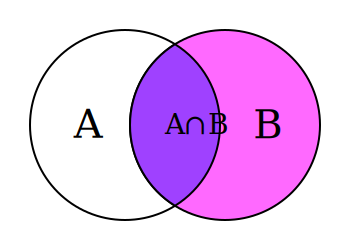

# Join and Union

## Join

### 什麼是 Join ？ 
JOIN 是一個 SQL 語法，用於結合兩個或多個表格的資料，根據指定的條件進行資料的合併。JOIN 的主要目的是要取得多個表格中相關的資料，並將其結合成一個新的結果集。

### 交集示意圖



### INNER JOIN




### LEFT JOIN



### RIGHT JOIN



### JOIN 範例

``` sql
SELECT *
FROM 表格1
JOIN 表格2
ON 表格1.欄位 = 表格2.欄位;
```

### 參考資料

1. [SQL JOIN 的圖解筆記 ](https://sam.webspace.tw/2019/07/11/SQL-JOIN/)
2. [Say NO to Venn Diagrams When Explaining JOINs](https://blog.jooq.org/say-no-to-venn-diagrams-when-explaining-joins/)
3. [Visual Representation of SQL Joins](https://www.codeproject.com/Articles/33052/Visual-Representation-of-SQL-Joins)
4. [File:Venn A intersect B.svg](https://zh.m.wikiversity.org/zh-hk/File:Venn_A_intersect_B.svg)

## Union

### 什麼是 Union ？ 
UNION 是一個 SQL 語法，用於結合兩個或多個 SELECT 陳述式的結果集，將其合併成一個新的結果集。UNION 的主要目的是要取得多個 SELECT 陳述式中不同的資料，並將其結合成一個新的結果集。

### UNION 特點
1. 只返回不同的資料：UNION 會自動去除重複的資料，只返回不同的資料。
2. 順序不重要：UNION 不關心 SELECT 陳述式的順序，結果集的順序將根據資料的值來決定。
3. 資料型別必須相同：UNION 的每個 SELECT 陳述式必須返回相同數量和相同資料型別的欄位。

### UNION 範例
如果你有兩個表格：顧客（customer）和潛在顧客（prospect），你可以使用 UNION 將這兩個表格的資料結合起來，取得所有顧客和潛在顧客的資料。

``` sql
SELECT *
FROM 顧客
UNION
SELECT *
FROM 潛在顧客;
```
注意：如果你想要保留重複的資料，可以使用 `UNION ALL` 代替 `UNION`。


